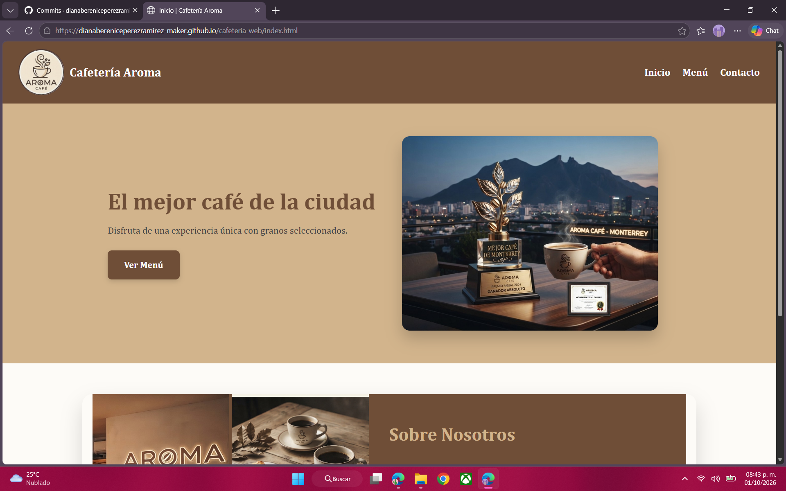
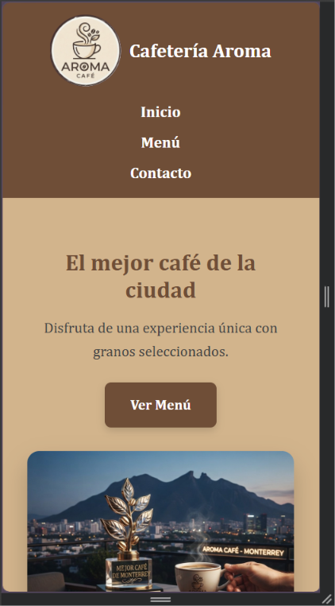
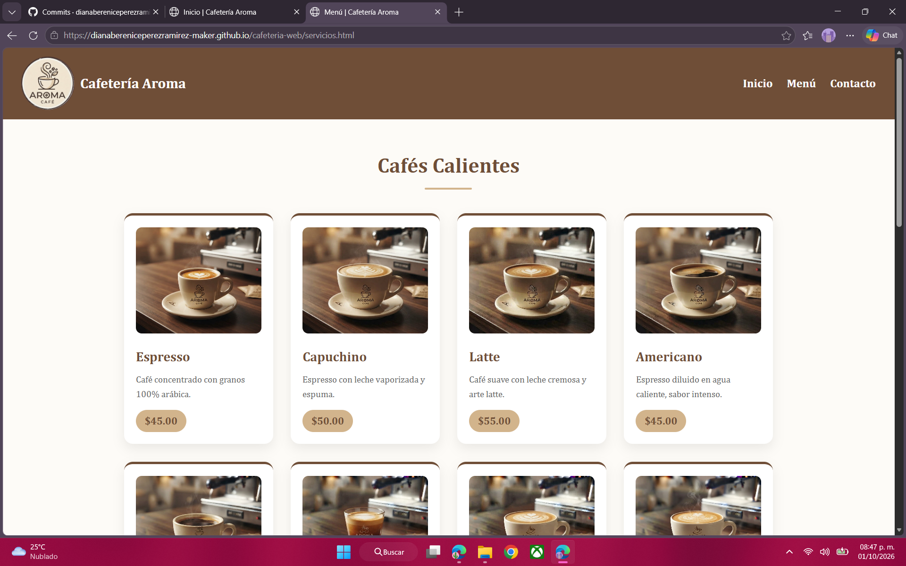
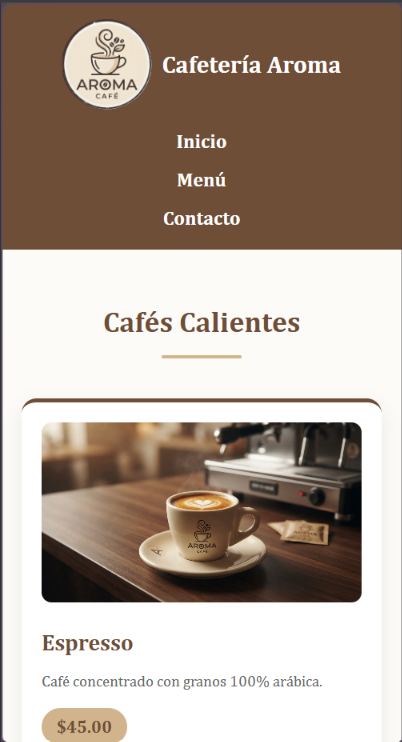
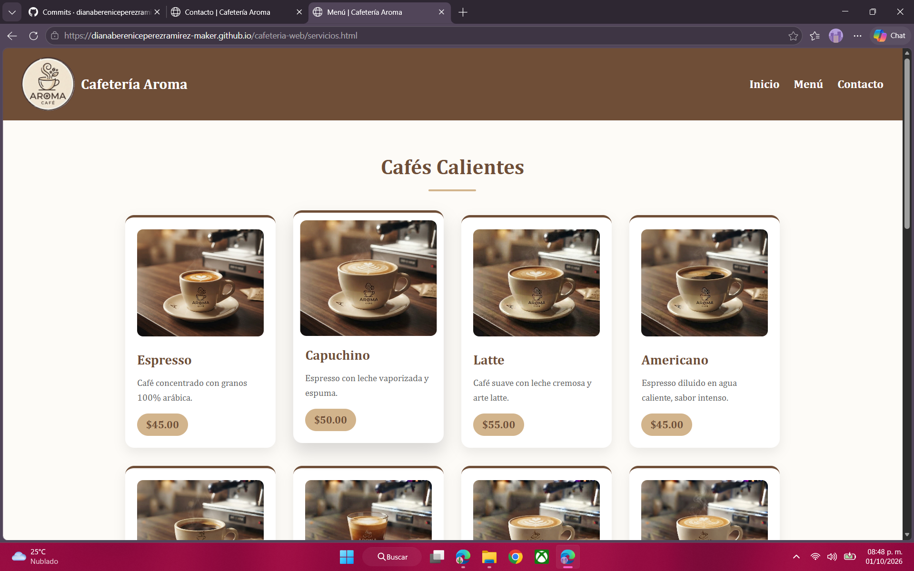
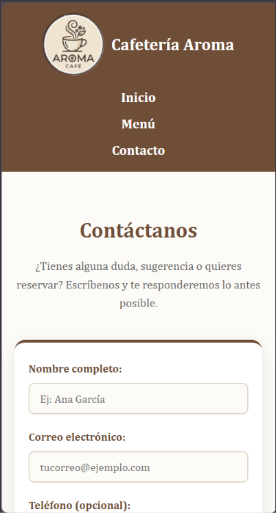
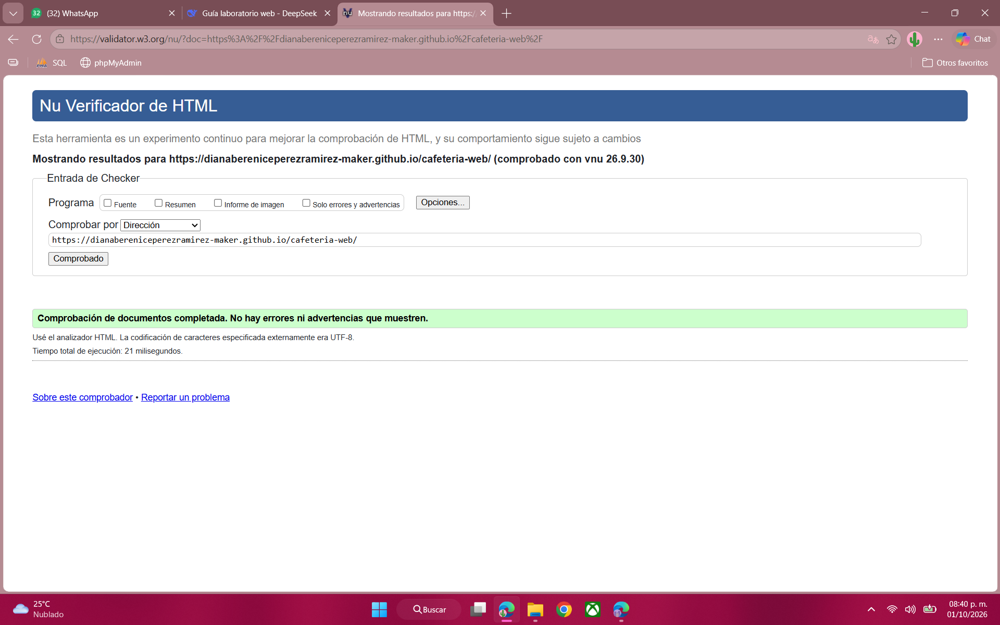
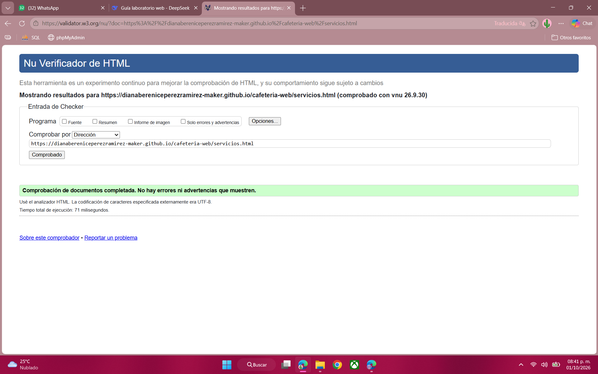
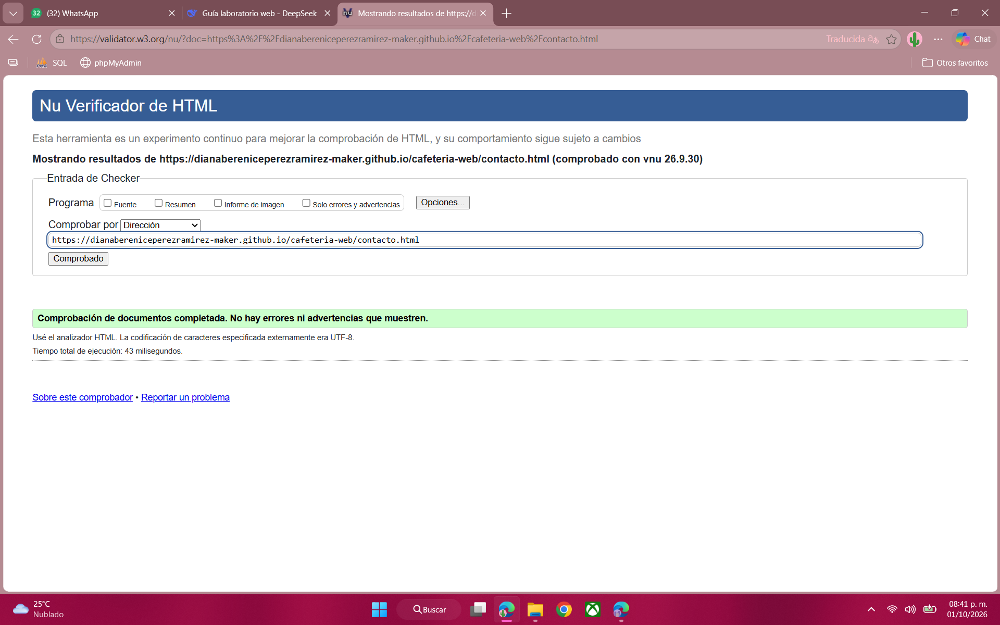
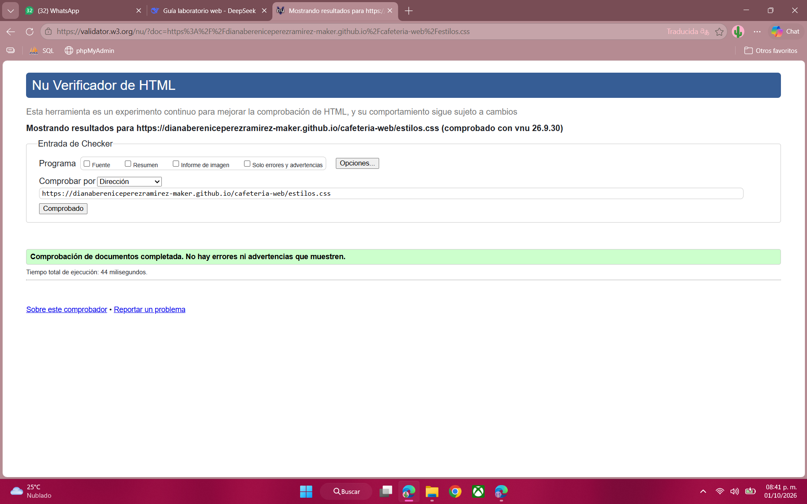

# Cafetería Aroma - Sitio Web

Sitio web responsivo, semántico y accesible para una cafetería de especialidad. Desarrollado como parte del **Laboratorio de Programación Web - Actividad 2**.

**Sitio publicado:** [https://dianabereniceperezramirez-maker.github.io/cafeteria-web/](https://dianabereniceperezramirez-maker.github.io/cafeteria-web/)

---

## Objetivo

Construir y publicar un sitio web responsivo utilizando HTML5 semántico y CSS moderno, aplicando principios básicos de usabilidad, accesibilidad y validación de estándares.

El sitio cumple con:
- Mínimo 3 vistas: Inicio, Menú y Contacto.
- Etiquetas semánticas HTML5 (`header`, `nav`, `main`, `section`, `article`, `footer`).
- Diseño con Flexbox y CSS Grid.
- Diseño responsivo con breakpoint en 768px.
- Buenas prácticas de accesibilidad (alt, labels, contraste, jerarquía).
- Validación en W3C (HTML y CSS sin errores).
- Publicación en GitHub Pages.

---

## Tecnologías utilizadas

- **HTML5** semántico
- **CSS3** (Flexbox, Grid, Variables CSS, Media Queries)
- **GitHub Pages** (despliegue)
- **W3C Validator** (validación de código)
- **Visual Studio Code** (editor)

---

## Estructura del proyecto
cafeteria-web/
├── index.html # Página de Inicio
├── servicios.html # Página de Menú
├── contacto.html # Página de Contacto
├── estilos.css # Hoja de estilos única
├── README.md
├── logo.jpg
├── nosimg1.jpg
├── nosimg2.jpg
├── nosimg3.jpg
├── cafciu.jpg
├── capturas/ # Capturas para documentación
│ ├── inicio-desktop.png
│ ├── inicio-movil.png
│ ├── menu-desktop.png
│ ├── menu-movil.png
│ ├── contacto-desktop.png
│ ├── contacto-movil.png
│ ├── validacion-html.png
│ ├── validacion-servicios.png
│ ├── validacion-contacto.png
│ └── validacion-css.png
└── menu/ # Imágenes de productos
├── expresso.jpg
├── capuccino.jpg
├── latte.jpg
├── americano.jpg
├── moka.jpg
├── frappe.jpg
├── coldbrew.jpg
├── croissant.jpg
├── cheesecake.jpg
└── brownie.jpg


---

## Características principales

### Estructura semántica
- Uso correcto de `<header>`, `<nav>`, `<main>`, `<section>`, `<article>` y `<footer>`.
- Jerarquía de encabezados coherente (`h1` → `h2` → `h3`).

### Diseño responsivo
- **Flexbox** para el header, el hero y la sección "Sobre Nosotros".
- **CSS Grid** para las galerías y el grid del menú.
- **Media Queries** con breakpoint en `768px` para adaptar el sitio a móviles.

### Accesibilidad
- Atributos `alt` descriptivos en todas las imágenes.
- `<label>` asociados correctamente a cada `<input>` del formulario.
- Contraste de color adecuado (texto café sobre fondos claros y texto blanco sobre café).
- Navegación clara y consistente en las 3 páginas.

### Estilos
- Paleta de colores cálida basada en café (`#6F4E37`), latte (`#D2B48C`) y crema (`#FDFBF7`).
- Tipografía serif (`Cambria, Georgia`) para un ambiente artesanal.
- Tarjetas con sombras, esquinas redondeadas y efectos hover.

---

## Capturas de pantalla

### Vista Desktop - Inicio


### Vista Móvil - Inicio


### Vista Desktop - Menú


### Vista Móvil - Menú


### Vista Desktop - Contacto


### Vista Móvil - Contacto


---

## Resultados de validación

### Validación HTML5 - Inicio (W3C)


### Validación HTML5 - Menú (W3C)


### Validación HTML5 - Contacto (W3C)


### Validación CSS3 (W3C)


> Todos los archivos HTML y CSS pasaron la validación del W3C **sin errores ni advertencias**.

---

## Cómo ejecutar el proyecto localmente

1. Clona este repositorio:
   ```bash
   git clone https://github.com/dianabereniceperezramirez-maker/cafeteria-web.git

2. Abre la carpeta en Visual Studio Code.

3. Abre index.html con la extensión Live Server o directamente en tu navegador.

4. Navega entre las páginas usando el menú superior.

## Laboratorio de Programación Web
Actividad 2: Desarrollo de un sitio web responsivo, semántico y accesible.
Fecha: Octubre 2026.

## Autores:
- Diana Berenice Pérez Ramírez
- Sigfrid Alexander Morales Rocha
- Alix Brisel Vega de León
- Luz Janeth Contreras Ortega 
